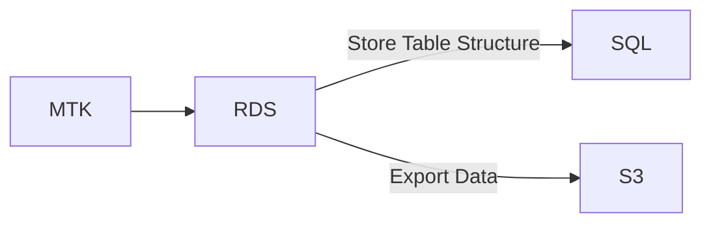
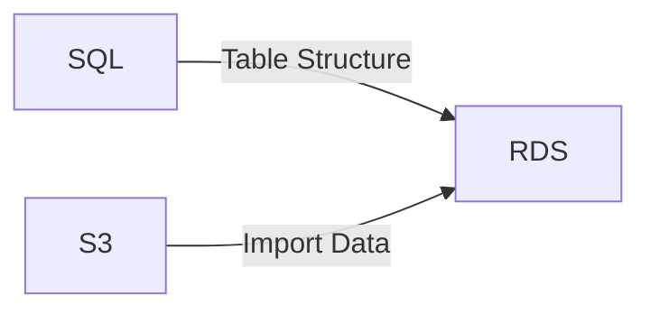

# AWS RDS

MySQL Toolkit offers native integration with AWS RDS, enabling developers to seamlessly copy data from an Aurora MySQL-Compatible DB directly into Amazon S3. This can be achieved (under the hood) using the [SELECT INTO OUTFILE S3 statement](https://docs.aws.amazon.com/prescriptive-guidance/latest/archiving-mysql-data/export-data-by-using-select-into-outfile-s3.html).

## Data flow

This feature results in a backup and restore workflow that looks like the below.

### Backup



### Restore



## Performance

By utilizing this approach, we've observed a 30% improvement in performance for database backups and restores on [our hosting platform](https://skpr.com.au).

## Usage

Below demonstrates how the `mtk dump` command can be updated to enable AWS RDS integration.

**Before**

```bash
mtk dump -u USERNAME -pPASSWORD -h HOSTNAME DATABASE > export.sql
```

**After**

```bash
# Flags
mtk dump --provider=rds --rds-region=ap-southeast-2 --rds-s3-uri=s3://my-s3-bucket -u USERNAME -pPASSWORD -h HOSTNAME DATABASE > export.sql

# Environment variables
export MTK_PROVIDER=rds
export MTK_RDS_REGION=ap-southeast-2
export MTK_RDS_S3_URI=s3://my-s3-bucket
mtk dump -u USERNAME -pPASSWORD -h HOSTNAME DATABASE > export.sql
```