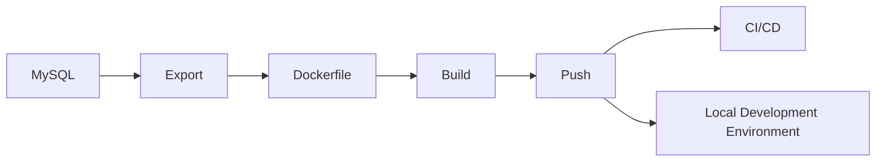

# Database Image

The MTK project introduced the term [database images](https://www.previousnext.com.au/blog/containerized-databases-developers) in 2018, revolutionizing the way databases are packaged and shared with development teams and CI/CD pipelines. This modern approach streamlines collaboration and enhances efficiency across the development lifecycle.

This document outlines how a MySQL export can be converted into a database image and shared with local development envrionments and CI/CD pipelines.



## Build a Docker image

Let's build a database image using the sanitized database export from the [tutorial](/docs/tutorial).

First, create a Dockerfile which will import the sanitized database export.

In this example we are using MySQL images from our [image repository](https://github.com/skpr/image-mysql).

```dockerfile
FROM docker.io/skpr/mysql:8.x-v3-latest

ADD export.sql /tmp/export.sql
RUN database-import local local local /tmp/export.sql
```

Next, build the image with Docker.

```bash
docker build -t docker.io/my/database:latest .
```

## Push to a registry

Using Docker, push the database image to a registry that enforces role-based access controls, ensuring that only authorized users and systems can pull and utilize the image.

```bash
docker push docker.io/my/database:latest
```

## Integrate into local development workflow

Below is an example of how a development team can integrate the image into their local Docker Compose environment.

```yml
services:
  database:
    image: docker.io/my/database:latest
```

The application, in this case Drupal, is then configured to establish a connection with the database.

```php
$databases['default']['default'] = array(
  'driver' => 'mysql',
  'database' => 'local',
  'username' => 'drupal',
  'password' => 'drupal',
  'host' => 'database',
);
```

## Integrate with your CI/CD Pipeline

Here are several examples of how database images can be seamlessly integrated into a continuous integration and deployment (CI/CD) pipeline.

### CircleCI

```yml
version: 2.1

jobs:
  build:
    docker:
      - image: docker.io/my/database:latest  
```

### Github Actions

```yml
jobs:
  build:
    runs-on: ubuntu-latest

    steps:
      - name: Pull and run database image
        run: |
          docker pull docker.io/my/database:latest
          docker run -d --network=host docker.io/my/database:latest
```

### Other

As demonstrated above, it is easy to integrate this into any modern continuous integration and deployment pipeline.
